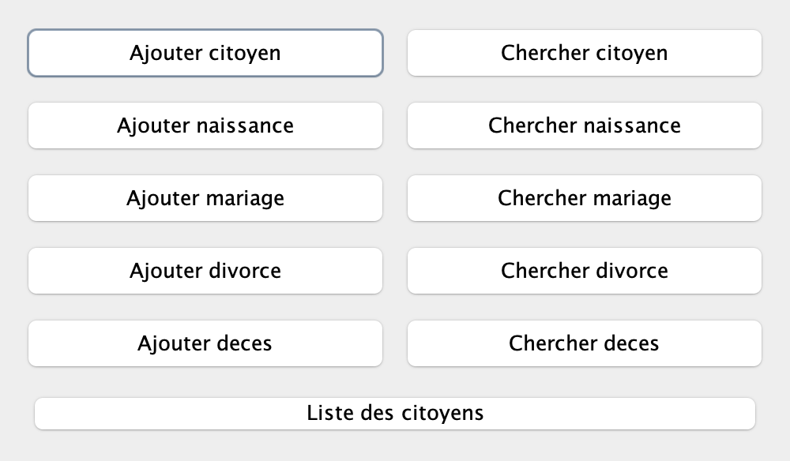
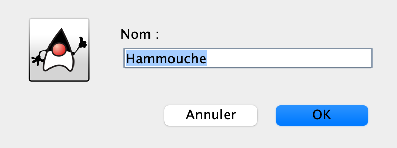
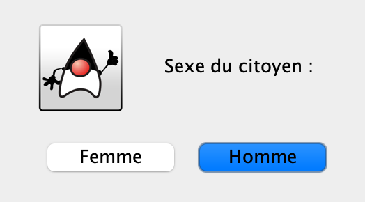
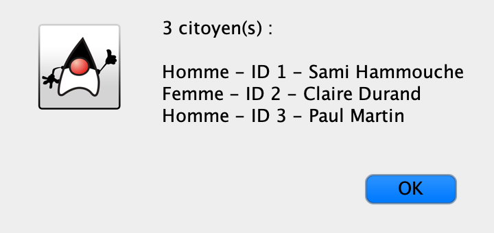

# Town Hall Manager

Application Java de gestion d'état civil pour une mairie : les citoyens et les évènements qui jalonnent leur vie administrative — naissances, mariages, divorces et décès.

Projet de programmation orientée objet, L2 semestre 2.

## La base de départ

La conception est partie d'un diagramme de classes, le fichier `Mairie.mdj` à la racine du dépôt, qui sert de maquette au programme.

## Le modèle

| Classe | Rôle |
|---|---|
| `Mairie` | le point d'entrée du modèle : elle garde la liste des citoyens et celle des évènements |
| `Citoyens` | une personne enregistrée : identifiant, nom, prénom, date de naissance, et la mairie dont elle dépend |
| `Homme`, `Femme` | les deux spécialisations de `Citoyens`, nécessaires aux règles du mariage |
| `EvenementCivil` | la classe mère de tous les actes, avec sa date et son identifiant |
| `Naissance`, `Mariage`, `Divorce`, `Deces` | les actes concrets, qui héritent d'`EvenementCivil` et relient les citoyens concernés |

L'héritage est au cœur du projet : un acte reste un `EvenementCivil`, ce qui permet de tous les manipuler de la même façon, et un `Homme` reste un `Citoyens`.

## L'interface

La fenêtre principale de la version finale, avec les dix actions de l'état civil et la liste des citoyens :



Chaque action demande ses informations une par une :





Et affiche le résultat renvoyé par le contrôleur :



## État du projet

Le modèle est en ligne. La version finale, avec son découpage en modèle, vue et contrôleurs et son interface graphique Swing, arrive au fur et à mesure dans ce dépôt.

## Compiler et lancer

```bash
javac ModelMairie/*.java
java -cp . Main
```

Il faut un JDK 17 ou plus récent.
